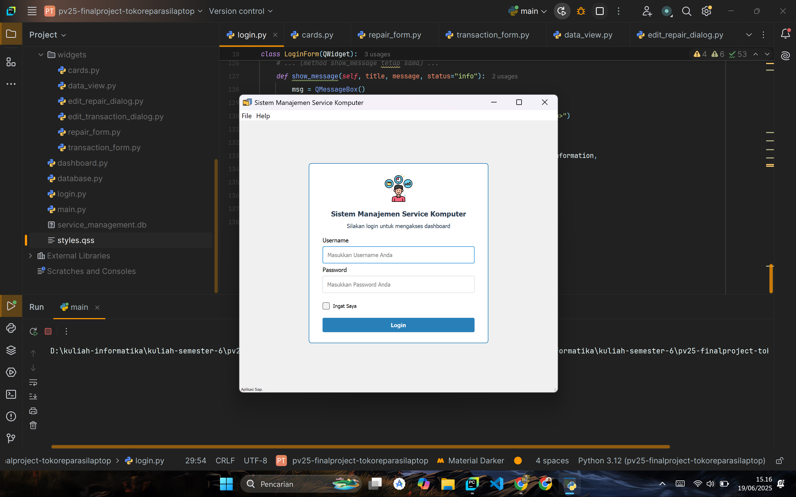
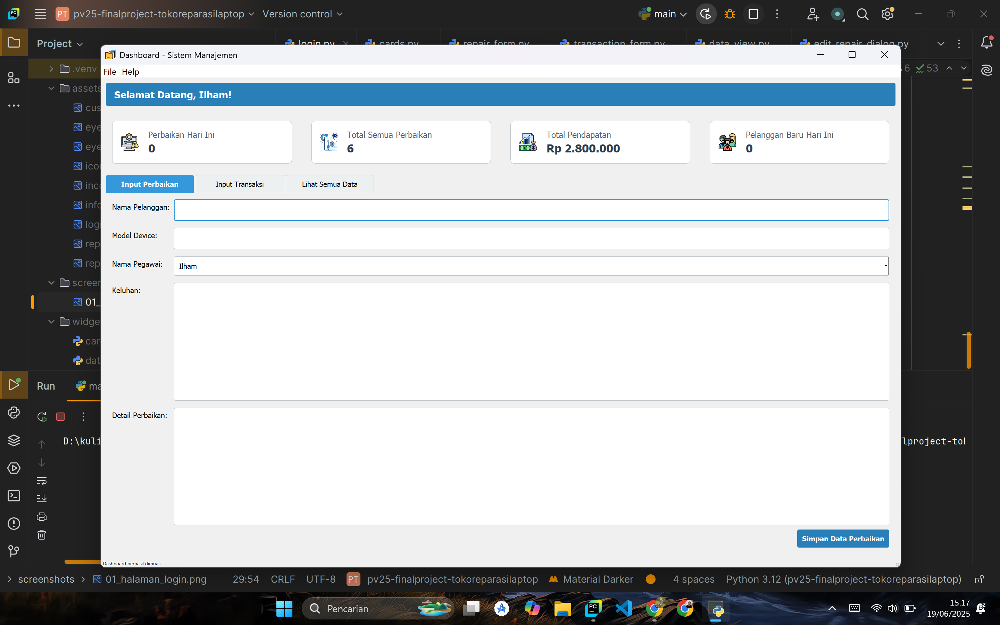
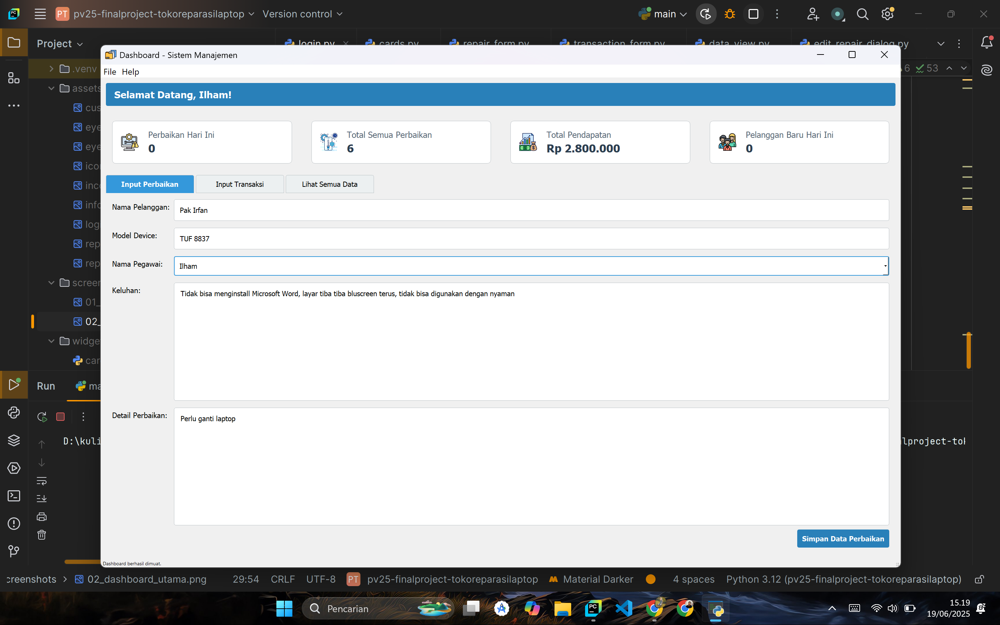
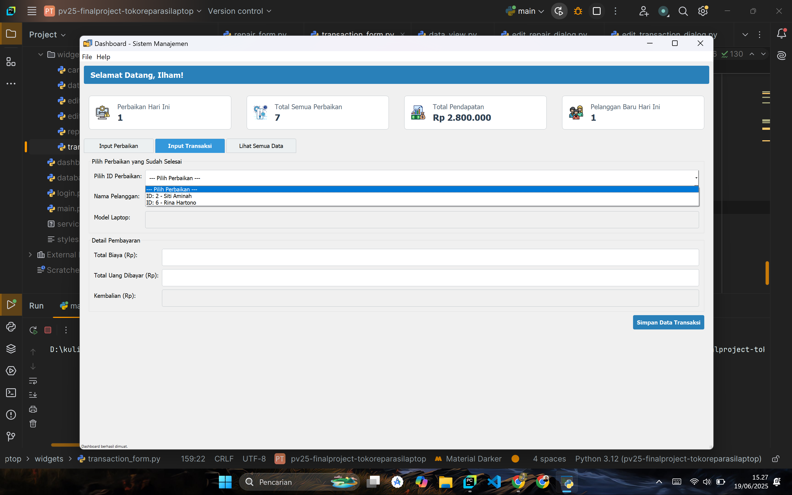
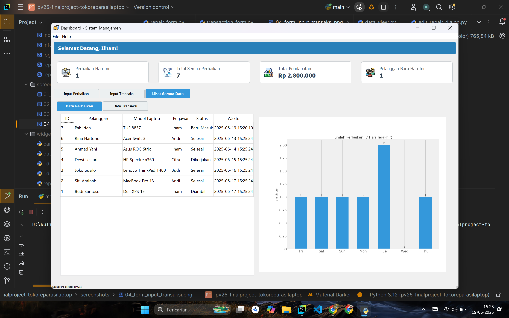
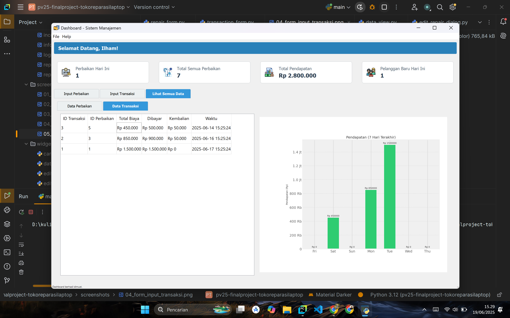
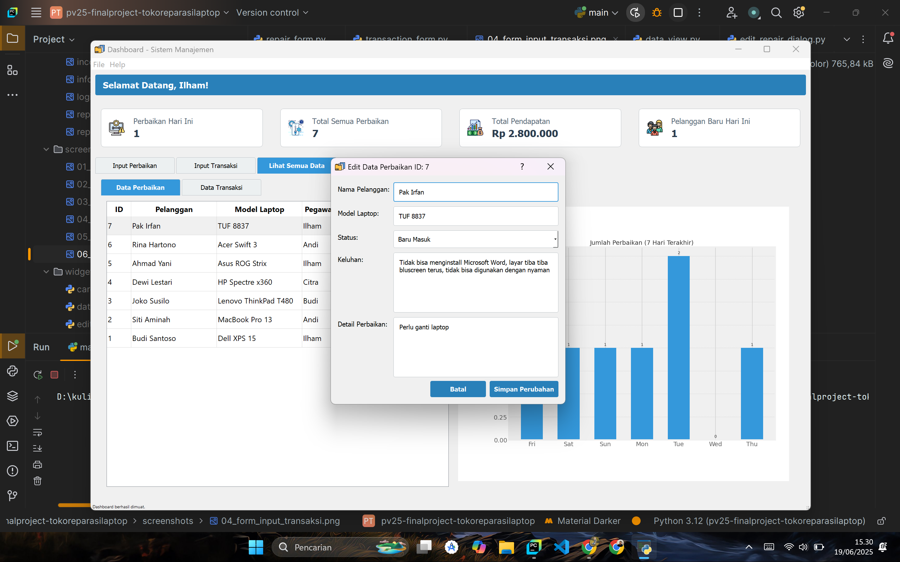
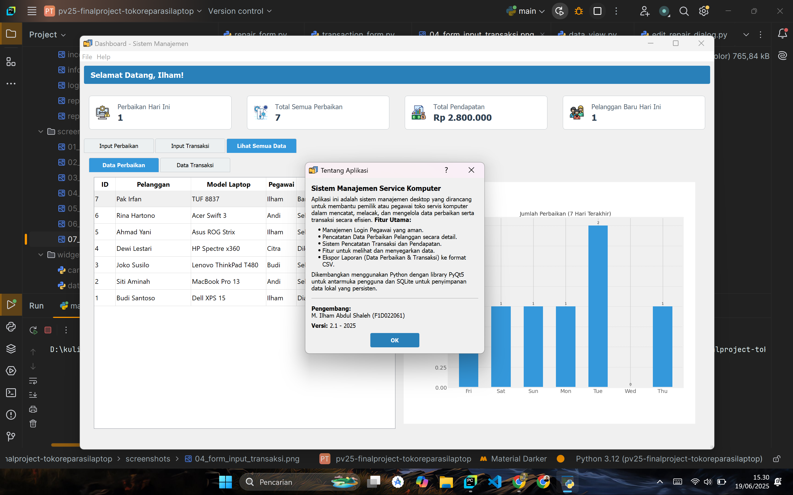

# Sistem Manajemen Toko Servis Komputer

Aplikasi ini adalah sistem manajemen desktop yang dirancang untuk membantu pemilik atau pegawai toko servis komputer dalam mencatat, melacak, dan mengelola data perbaikan serta transaksi secara efisien. Dibangun menggunakan Python dengan library PyQt5, aplikasi ini menyediakan antarmuka pengguna yang modern dan fungsional untuk mempermudah alur kerja sehari-hari.

## Proses Pengembangan

Proyek ini merupakan pengembangan dan peningkatan signifikan dari mini project yang telah dilakukan sebelumnya. Pengembangan dilakukan secara iteratif dengan fokus pada penambahan fitur, peningkatan pengalaman pengguna (UX), dan refactoring kode untuk kualitas yang lebih baik.

**Langkah-langkah pengembangan utama meliputi:**

1.  **Konsep Awal (Proyek Mini):**
    * Aplikasi awalnya dirancang sebagai sistem pencatatan sederhana.
    * Penyimpanan data masih menggunakan struktur data internal Python (list/array), yang berarti data akan hilang setiap kali aplikasi ditutup.
    * UI dibuat secara fungsional namun belum memiliki styling yang terpusat.

2.  **Analisis Kebutuhan dan Refactoring:**
    * Berdasarkan kebutuhan nyata, proyek di-upgrade untuk memenuhi serangkaian fitur profesional, termasuk sistem login, persistensi data, dan pelaporan.
    * **Migrasi Database:** Penyimpanan data diubah total dari list Python ke database **SQLite**. Sebuah modul khusus (`database.py`) dibuat untuk mengelola semua interaksi dengan database, termasuk pembuatan tabel (`pegawai`, `perbaikan`, `transaksi`) dan pengisian data awal/dummy.

3.  **Implementasi Fitur-Fitur Utama:**
    * **Sistem Login & Sesi:** Halaman login dibuat dengan validasi ke database dan enkripsi password dasar (hashing). Fitur "Ingat Saya" ditambahkan menggunakan `QSettings` untuk menyimpan sesi login.
    * **Dashboard Utama:** Dashboard dirancang sebagai pusat informasi dengan kartu statistik (misal: "Perbaikan Hari Ini", "Total Pendapatan") yang mengambil data agregat langsung dari database.
    * **Manajemen Data (CRUD):**
        * Form untuk **Input Perbaikan** dan **Input Transaksi** dibuat lebih cerdas. Contohnya, form transaksi kini menggunakan dropdown yang hanya menampilkan data perbaikan yang siap bayar.
        * Fitur **Edit Data** diimplementasikan melalui dialog pop-up yang muncul saat pengguna melakukan *double-click* pada baris tabel.
    * **Visualisasi Data:** Fitur grafik ditambahkan menggunakan library **Matplotlib** untuk menampilkan ringkasan data perbaikan dan pendapatan mingguan secara visual.
    * **Fungsionalitas Tambahan:** Menu bar (`File`, `Help`), status bar, dan fitur **Ekspor ke CSV** ditambahkan untuk melengkapi aplikasi.

4.  **Penyempurnaan UI/UX:**
    * **Styling Terpusat:** Semua styling yang tadinya berada di dalam kode Python (`setStyleSheet`) dipindahkan ke satu file eksternal (`styles.qss`) untuk konsistensi dan kemudahan dalam pengelolaan tampilan.
    * **Penyesuaian Iteratif:** Berdasarkan pengembangan sebelumnya, dilakukan banyak penyesuaian pada padding, ukuran font, layout, dan komponen UI lainnya untuk menciptakan pengalaman pengguna yang lebih nyaman dan profesional.

## Fungsionalitas Utama dan Komponen Kode

-   **`main.py`**: Titik masuk utama aplikasi. Bertanggung jawab untuk mengelola window utama, menu bar, status bar, dan perpindahan antara halaman login dan dashboard.
-   **`database.py`**: "Otak" dari persistensi data. Mengelola koneksi SQLite, pembuatan skema tabel, dan pengisian data awal.
-   **`login.py`**: Mengelola antarmuka dan logika untuk autentikasi pengguna, validasi input, dan fitur "Ingat Saya".
-   **`dashboard.py`**: Widget utama setelah login. Berisi kartu-kartu statistik dan `QTabWidget` yang menampung semua fungsionalitas inti (input form dan tampilan data).
-   **`widgets/`**: Folder ini berisi semua komponen UI modular.
    -   `data_view.py`: Komponen krusial yang menampilkan data dalam bentuk tabel dan grafik Matplotlib. Juga menangani logika untuk memicu dialog edit.
    -   `*_form.py`: Berisi form untuk input data baru (perbaikan dan transaksi).
    -   `*_dialog.py`: Berisi dialog pop-up yang digunakan untuk mengedit data yang sudah ada.
-   **`styles.qss`**: File Qt Style Sheets yang mendefinisikan seluruh tampilan dan nuansa aplikasi, mulai dari warna tombol, ukuran font, hingga padding pada form.

## Tampilan Aplikasi (Screenshot)

Berikut adalah beberapa tampilan kunci dari fungsionalitas aplikasi.

---

### 1. Halaman Login
* *Deskripsi: Tampilan awal aplikasi dengan input username, password, dan opsi "Ingat Saya".*
    

---

### 2. Dashboard Utama
* *Deskripsi: Tampilan utama setelah berhasil login. Menampilkan ucapan selamat datang, kartu statistik, dan tab fungsionalitas.*
    

---

### 3. Form Input Perbaikan
* *Deskripsi: Form untuk memasukkan data perbaikan baru dari pelanggan.*
    

---

### 4. Form Input Transaksi
* *Deskripsi: Form cerdas untuk input transaksi, dengan dropdown yang hanya menampilkan perbaikan yang sudah selesai dan belum lunas.*
    

---

### 5. Tampilan Data Perbaikan
* *Deskripsi: Menampilkan tabel data perbaikan yang ringkas berdampingan dengan grafik jumlah perbaikan harian.*
    

---

### 6. Tampilan Data Transaksi
* *Deskripsi: Menampilkan tabel riwayat transaksi berdampingan dengan grafik pendapatan harian.*
    

---

### 7. Dialog Edit Data
* *Deskripsi: Jendela pop-up yang muncul saat pengguna melakukan klik dua kali pada data di tabel untuk melakukan perubahan.*
    

---

### 8. Dialog "About"
* *Deskripsi: Jendela informasi yang berisi ringkasan tentang aplikasi dan data pengembang.*
    

---
